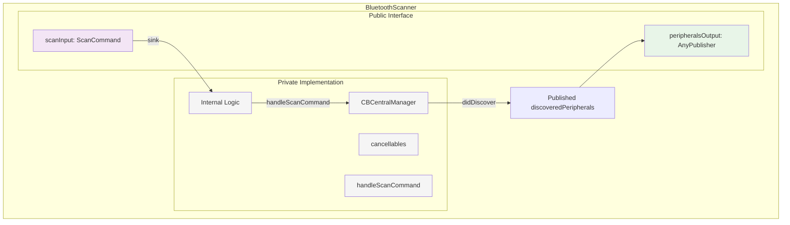
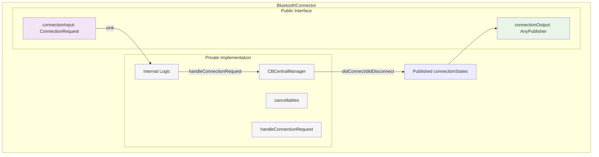
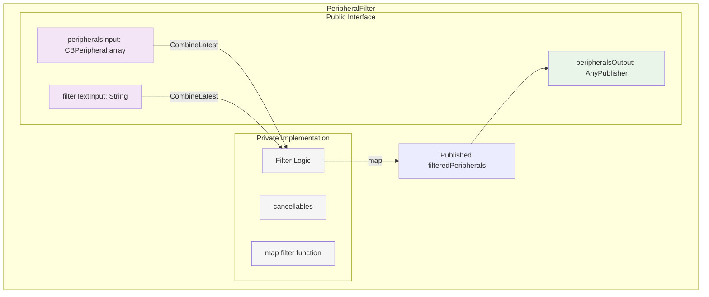
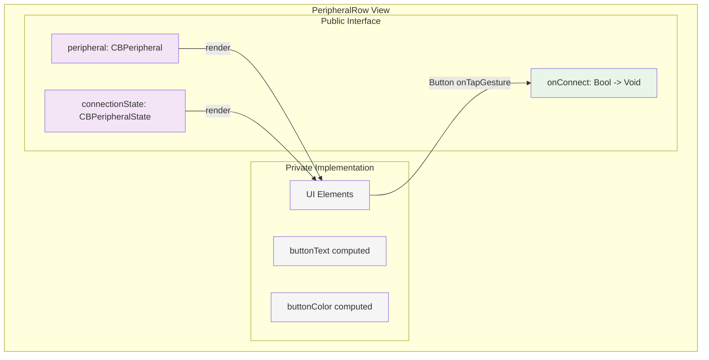

# Component Architecture Diagrams

This folder contains mermaid diagrams showing each component individually and how they compose into a working system.

## Individual Component Diagrams

### BluetoothScanner Component

### BluetoothConnector Component

### PeripheralFilter Component

### PeripheralRow Component

