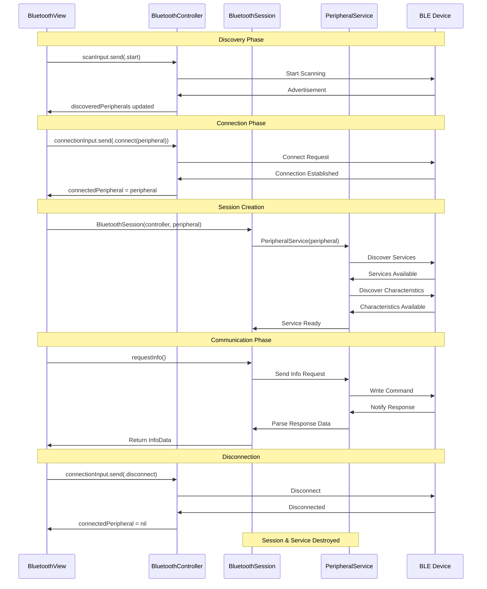

# Connection Lifecycle

This document describes the Bluetooth connection lifecycle and session management patterns.

## Current Connection Flow

## Connection Lifecycle Characteristics

### Service Creation Pattern
- **Timing**: Services created only when peripheral connects
- **Scope**: Services bound to specific peripheral connection
- **Memory**: Automatically cleaned up on disconnect
- **Discovery**: Service/characteristic discovery happens immediately on creation

### Session Management
- **BluetoothSession**: High-level interface created per connection
- **PeripheralService**: Low-level BLE communication handler
- **Lifecycle**: Both destroyed when connection ends
- **State**: Each connection gets fresh service state

## Key Architecture Benefits

### Memory Efficiency
- No persistent objects between connections
- Services destroyed automatically on disconnect
- Clean slate for each new connection

### Error Recovery
- Connection failures automatically clean up service state
- No lingering state from failed connections
- Robust reconnection handling

### Simplicity
- Service creation tied directly to connection success
- Automatic discovery eliminates manual setup
- Clear lifecycle boundaries

### Future Extensibility
- Pattern works for both short-lived and persistent connections
- Easy to add connection-scoped features
- Maintains clean separation of concerns
