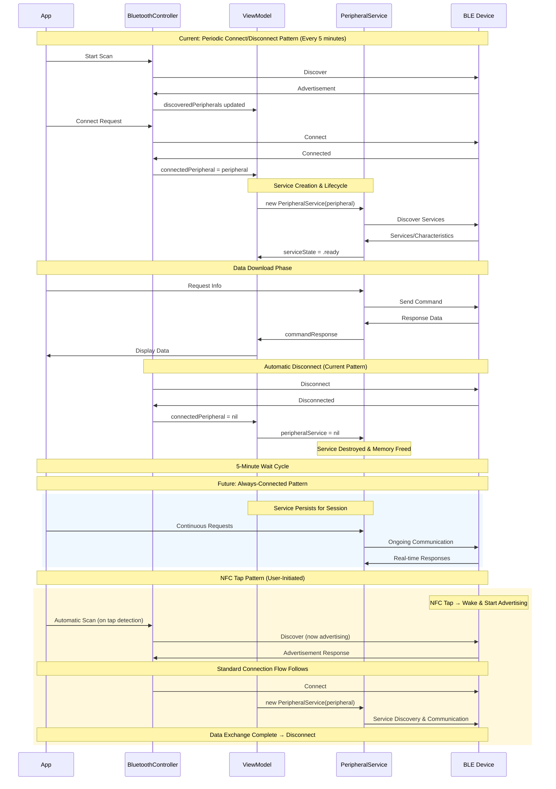

# Connection Lifecycle Diagram

## System Connection Behavior

This diagram shows the connection lifecycle patterns for the Bluetooth system, including current behavior and future evolution.

## Key Lifecycle Characteristics

### Current Pattern (Periodic Cycles)
- **Connection Duration**: Short-lived (seconds to minutes)
- **Frequency**: Every 5 minutes or more often
- **Purpose**: Connect → Download → Disconnect
- **Service Lifecycle**: Created per connection, destroyed on disconnect

### Future Pattern (Always-Connected)
- **Connection Duration**: Long-lived (hours to session)
- **Frequency**: Single connection per session
- **Purpose**: Continuous communication
- **Service Lifecycle**: Created once, persists for session

### NFC Tap Pattern (User-Initiated)
- **Connection Duration**: Short-lived (triggered by user action)
- **Frequency**: On-demand via NFC tap
- **Purpose**: Wake device → Connect → Download → Disconnect
- **Service Lifecycle**: Created per tap event, destroyed after data exchange

## Architecture Alignment

### Perfect Match with Initialization Design
1. **Service Creation**: Tied to connection establishment
2. **Automatic Discovery**: Starts immediately upon connection
3. **Memory Management**: Service cleaned up on disconnect
4. **State Isolation**: Each connection gets fresh service state
5. **Future Compatibility**: Works for both patterns seamlessly

### Benefits
- **Periodic Pattern**: Clean slate for each connection cycle
- **Always-Connected**: Single service instance for persistent connection
- **Memory Efficient**: No persistent objects between connections
- **Error Recovery**: Connection failures automatically clean up service state
