# Current Implementation Architecture (Post-Refactor)

This document describes the current system after refactoring, showing a unified view of the component architecture with simplified internal structure.

## System Architecture

```mermaid
graph TD
    %% User Interface Layer
    subgraph "User Interface"
        UT[Search Text Field]
        UB1[Start Scan Button]
        UB2[Stop/Clear Button]
        UB3[Connect Button]
        UB4[Get Info Button]
        UB5[Get EData Button]
    end

    %% BluetoothSession Boundary
    subgraph BS["BluetoothSession Wrapper"]
        %% BluetoothController Component
        subgraph BC_Group["BluetoothController"]
            direction TB
            subgraph BC_IN[" "]
                BCSI["🔌 scanInput"]
                BCCI["🔌 connectionInput"]
            end
            BC["Central Manager &<br/>State Management"]
            subgraph BC_OUT[" "]
                BSO["📡 discoveredPeripherals"]
                BCO["📡 connectionStates"]
                BCP["📡 connectedPeripheral"]
            end
            BC_IN --> BC --> BC_OUT
        end

        %% PeripheralFilter Component
        subgraph PF_Group["PeripheralFilter"]
            direction TB
            subgraph PF_IN[" "]
                PFI1["🔌 peripheralsInput"]
                PFI2["🔌 filterTextInput"]
            end
            PF["Filter Logic"]
            subgraph PF_OUT[" "]
                PFO["📡 peripheralsOutput"]
            end
            PF_IN --> PF --> PF_OUT
        end

        %% PeripheralService Component (Connection-Scoped)
        subgraph PS_Group["PeripheralService"]
            direction TB
            subgraph PS_IN[" "]
                PSCI["🔌 commandInput"]
            end
            PS["BLE Communication<br/>& Message Processing"]
            subgraph PS_OUT[" "]
                PSSO["📡 serviceStateOutput"]
                PSCO["📡 commandResponseOutput"]
            end
            PS_IN --> PS --> PS_OUT

            %% Internal utilities notation
            subgraph PS_Internal["Internal Utilities"]
                CS_Note["CommandService<br/><i>correlation & sequencing</i>"]
                MP_Note["MessageParser<br/><i>static parsing</i>"]
            end
            PS -.-> PS_Internal
        end
    end

    %% UI View Layer
    BV[BluetoothView<br/>SwiftUI Bindings]

    %% User Input Connections
    UT --> PFI2
    UB1 --> BCSI
    UB2 --> BCSI
    UB3 --> BCCI
    UB4 --> PSCI
    UB5 --> PSCI

    %% Component Interconnections
    BSO --> PFI1
    BCP --> PS

    %% Output to UI
    PFO --> BV
    BCO --> BV
    PSSO --> BV
    PSCO --> BV

    %% Styling
    classDef userInput fill:#fff3e0,stroke:#ff9800,stroke-width:2px
    classDef componentCore fill:#e3f2fd,stroke:#2196f3,stroke-width:2px
    classDef inputSection fill:#f0f8f0,stroke:#4caf50,stroke-width:1px
    classDef outputSection fill:#fff8f0,stroke:#ff9800,stroke-width:1px
    classDef view fill:#fce4ec,stroke:#e91e63,stroke-width:2px
    classDef wrapper fill:#ffffff,stroke:#999999,stroke-width:2px,stroke-dasharray: 5 5
    classDef componentGroup fill:#ffffff,stroke:#cccccc,stroke-width:2px,rx:10,ry:10
    classDef internalNote fill:#f9f9f9,stroke:#cccccc,stroke-width:1px,stroke-dasharray: 2 2

    class UT,UB1,UB2,UB3,UB4,UB5 userInput
    class BC,PF,PS componentCore
    class BC_IN,PF_IN,PS_IN inputSection
    class BC_OUT,PF_OUT,PS_OUT outputSection
    class BV view
    class BS wrapper
    class BC_Group,PF_Group,PS_Group componentGroup
    class PS_Internal,CS_Note,MP_Note internalNote
```



## Component Architecture

### BluetoothController
*Unified Bluetooth management component*

**Inputs:**
- `scanInput: PassthroughSubject<ScanCommand, Never>`
- `connectionInput: PassthroughSubject<ConnectionRequest, Never>`

**Outputs:**
- `discoveredPeripherals: @Published [CBPeripheral]`
- `connectionStates: @Published [UUID: CBPeripheralState]`
- `connectedPeripheral: @Published CBPeripheral?`

**Responsibilities:**
- Device scanning and discovery
- Connection management
- Bluetooth state handling
- Central Manager operations

### PeripheralFilter
*Device filtering and search*

**Inputs:**
- `peripheralsInput: CurrentValueSubject<[CBPeripheral], Never>`
- `filterTextInput: CurrentValueSubject<String, Never>`

**Outputs:**
- `peripheralsOutput: CurrentValueSubject<[CBPeripheral], Never>`

**Responsibilities:**
- Real-time peripheral filtering
- Search functionality
- List processing

### PeripheralService (Refactored)
*BLE communication orchestrator with internal utilities*

**External Interface:**

**Inputs:**
- `commandInput: PassthroughSubject<PeripheralCommand, Never>`

**Outputs:**
- `serviceStateOutput: CurrentValueSubject<ServiceState, Never>`
- `commandResponseOutput: PassthroughSubject<CommandResponse, Never>`

**Internal Utilities:**
- **CommandService**: Request/response correlation and sequencing (regular object with method calls)
- **MessageParser**: Protobuf parsing and validation (static utility functions)

**Responsibilities:**
- BLE characteristic management and communication
- Command processing orchestration
- Service discovery and setup
- Error handling and state management

### CommandService (Internal Utility)
*Request/response correlation and command sequencing*

**Interface:**
- `processCommand(_ command: PeripheralCommand) -> Result<CommandData, Error>`
- `handleResponse(_ message: ParsedMessage) -> CommandResponse?`
- `getTimeoutErrors() -> [CommandResponse]`

**Responsibilities:**
- Command serialization with sequence numbers
- Request/response correlation via sequence numbers
- Timeout handling for pending requests
- Error management and cleanup

### MessageParser (Internal Utility)
*Protobuf message parsing and validation*

**Static Interface:**
- `static parse(_ data: Data) -> Result<ParsedMessage, ParsingError>`

**Responsibilities:**
- Protobuf deserialization from BLE data
- Message type routing (info responses, data blocks, status events)
- Data validation and error handling
- Converting raw bytes to structured messages

## Data Flow Sequence

### 1. Command Processing Flow
```
User Action → PeripheralService.handleCommand() → CommandService.processCommand()
→ Command Serialization → BLE Write → Device Processing
```

### 2. Response Processing Flow
```
Device Response → BLE Read → MessageParser.parse() → CommandService.handleResponse()
→ Response Correlation → PeripheralService → UI Update
```

### 3. Complete Round Trip
```
UI Command → CommandService (seq: 123) → BLE Write
→ Device → BLE Read → MessageParser → CommandService Match → Response → UI
```

## Key Architectural Benefits

### 1. Unified Architecture View
- Single diagram shows all components and relationships
- Clear separation between main components and internal utilities
- Visual distinction between external interfaces and internal implementation

### 2. Simplified Internal Communication
- **Direct method calls**: CommandService uses regular methods instead of reactive streams
- **No stream wiring**: Eliminates complex Publisher/Subscriber setup
- **Clearer data flow**: Input → Processing → Output without intermediate streams

### 3. Improved Testability
- CommandService can be tested with direct method calls
- MessageParser can be tested as static utility functions
- PeripheralService can be tested with mock CommandService

### 4. Better Maintainability
- **Reduced complexity**: Fewer reactive streams to manage
- **Stateless utilities**: MessageParser has no instance state
- **Focused responsibilities**: Each component has a clear, single purpose

### 5. Future Extensibility
- New message types only affect MessageParser static methods
- New correlation strategies only affect CommandService methods
- New BLE behaviors only affect PeripheralService orchestration
- Multi-block requests can be added to CommandService without changing interfaces

## Message Handling Assumptions

This architecture relies on the guarantees provided by the underlying reactive framework (Combine) for external component communication. Internal utilities use direct method calls for simplicity and clarity.

Components handle errors within their boundaries and communicate error states through their output streams rather than throwing exceptions across component boundaries.
```
    class BC_OUT,PF_OUT,PS_OUT outputSection
    class BV view
    class BS wrapper
    class BC_Group,PF_Group,PS_Group componentGroup
```

## PeripheralService Internal Architecture


## Component Architecture

### BluetoothController
*Unchanged - unified Bluetooth management*

**Inputs:**
- `scanInput: PassthroughSubject<ScanCommand, Never>`
- `connectionInput: PassthroughSubject<ConnectionRequest, Never>`

**Outputs:**
- `discoveredPeripherals: @Published [CBPeripheral]`
- `connectionStates: @Published [UUID: CBPeripheralState]`
- `connectedPeripheral: @Published CBPeripheral?`

### PeripheralFilter
*Simplified - pure filtering logic*

**Inputs:**
- `peripheralsInput: CurrentValueSubject<[CBPeripheral], Never>`
- `filterTextInput: CurrentValueSubject<String, Never>`

**Outputs:**
- `peripheralsOutput: CurrentValueSubject<[CBPeripheral], Never>`

### PeripheralService (Refactored)
*BLE communication orchestrator with internal components*

**External Interface:**

**Inputs:**
- `commandInput: PassthroughSubject<PeripheralCommand, Never>`

**Outputs:**
- `serviceStateOutput: CurrentValueSubject<ServiceState, Never>`
- `commandResponseOutput: PassthroughSubject<CommandResponse, Never>`

**Internal Components:**
- **CommandService**: Request/response correlation and sequencing
- **MessageParser**: Protobuf parsing and validation
- **BLE Communication**: CBPeripheral characteristic management

### CommandService (Internal Component)
*Request/response correlation and command sequencing*

**Interface:**
- `processCommand(_ command: PeripheralCommand) -> Result<CommandData, Error>`
- `handleResponse(_ message: ParsedMessage) -> CommandResponse?`
- `getTimeoutErrors() -> [CommandResponse]`

**Responsibilities:**
- Command serialization with sequence numbers
- Request/response correlation via sequence numbers
- Timeout handling for pending requests
- Error management and cleanup

### MessageParser (Internal Utility)
*Protobuf message parsing and validation*

**Static Interface:**
- `static parse(_ data: Data) -> Result<ParsedMessage, ParsingError>`

**Responsibilities:**
- Protobuf deserialization from BLE data
- Message type routing (info responses, data blocks, status events)
- Data validation and error handling
- Converting raw bytes to structured messages

## Data Flow Sequence

### 1. Command Processing Flow
```
User Action → PeripheralService.handleCommand() → CommandService.processCommand()
→ Command Serialization → BLE Write → Device Processing
```

### 2. Response Processing Flow
```
Device Response → BLE Read → MessageParser.parse() → CommandService.handleResponse()
→ Response Correlation → PeripheralService → UI Update
```

### 3. Complete Round Trip
```
UI Command → CommandService (seq: 123) → BLE Write
→ Device → BLE Read → MessageParser → CommandService Match → Response → UI
```

## Key Architectural Benefits

### 1. High-Level Simplicity
- External components see PeripheralService as a single unit
- Clean input/output interface maintained
- Internal complexity is encapsulated

### 2. Simplified Internal Communication
- **Direct method calls**: CommandService uses regular methods instead of reactive streams
- **No stream wiring**: Eliminates complex Publisher/Subscriber setup
- **Clearer data flow**: Input → Processing → Output without intermediate streams

### 3. Improved Testability
- CommandService can be tested with direct method calls
- MessageParser can be tested as static utility functions
- PeripheralService can be tested with mock CommandService

### 4. Better Maintainability
- **Reduced complexity**: Fewer reactive streams to manage
- **Stateless utilities**: MessageParser has no instance state
- **Focused responsibilities**: Each component has a clear, single purpose

### 5. Future Extensibility
- New message types only affect MessageParser static methods
- New correlation strategies only affect CommandService methods
- New BLE behaviors only affect PeripheralService orchestration
- Multi-block requests can be added to CommandService without changing interfaces## Message Handling Assumptions

This architecture relies on the guarantees provided by the underlying reactive framework (Combine).
In the local app context, message delivery between internal components is reliable and
synchronous/asynchronous behavior is handled by the framework.

Internal components handle errors within their boundaries and communicate error states
through their output streams rather than throwing exceptions across component boundaries.
