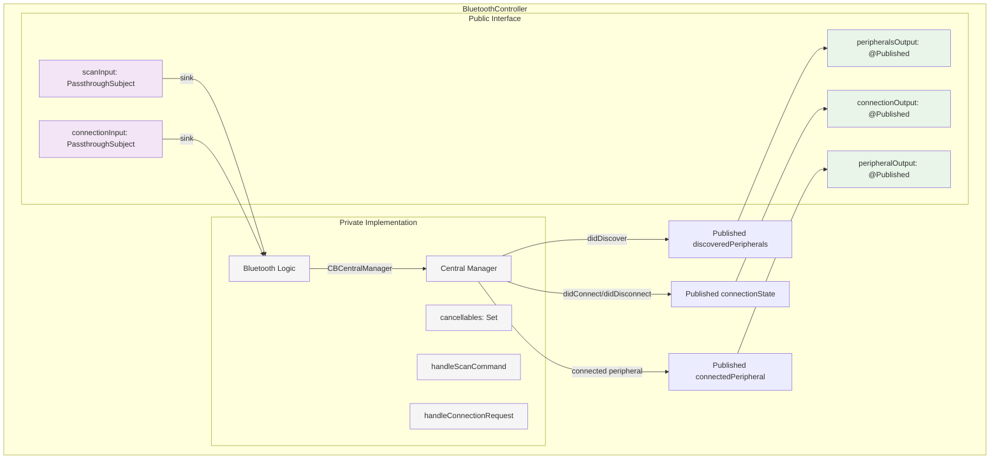

# Refactored Bluetooth Component Architecture

## Architecture Overview

Following our software tenets of Simple, Testable, Modular - we're creating a logical separation without unnecessary abstraction. The BluetoothController handles core Bluetooth operations (scan/connect), while a new PeripheralService module handles peripheral interactions (service discovery, commands, responses).

## Core Components

### BluetoothController Component
*Handles scanning, connection, and general Bluetooth management*



### PeripheralService Component
*Initialized with peripheral, handles service discovery and command processing*

```mermaid
graph TD
    subgraph "PeripheralService"
        %% Initialization
        INIT[init(peripheral: CBPeripheral)] --> |stores| P[CBPeripheral]
        INIT --> |sets delegate| P
        INIT --> |starts| SD[Service Discovery]

        %% Inputs
        CI[commandInput: PassthroughSubject] --> |sink| CL[Command Logic]

        %% Core Logic
        CL --> |writeValue| P
        P --> |didDiscoverServices| SD
        P --> |didUpdateValue| RP[Response Parser]

        %% Outputs
        SD --> |Published| SSO[serviceStateOutput: CurrentValueSubject]
        RP --> |Published| CRO[commandResponseOutput: PassthroughSubject]

        subgraph "Private Implementation"
            P
            CL
            SD
            RP
            CC[cancellables: Set<AnyCancellable>]
            CR[constructRequest]
            PR[parseResponse]
        end

        subgraph "Public Interface"
            INIT
            CI
            SSO
            CRO
        end
    end

    %% Styling
    classDef input fill:#f3e5f5
    classDef output fill:#e8f5e8
    classDef private fill:#f5f5f5
    classDef init fill:#fff2cc

    class CI input
    class SSO,CRO output
    class P,CL,SD,RP,CC,CR,PR private
    class INIT init
```### PeripheralFilter Component
*Handles peripheral filtering (unchanged)*

```mermaid
graph TD
    subgraph "PeripheralFilter"
        PI[peripheralsInput: PassthroughSubject] --> |CombineLatest| FL[Filter Logic]
        FI[filterTextInput: CurrentValueSubject] --> |CombineLatest| FL
        FL --> |map| FP[Published filteredPeripherals]
        FP --> PO[peripheralsOutput: @Published]

        subgraph "Private Implementation"
            FL
            CC[cancellables: Set<AnyCancellable>]
        end

        subgraph "Public Interface"
            PI
            FI
            PO
        end
    end

    %% Styling
    classDef input fill:#f3e5f5
    classDef output fill:#e8f5e8
    classDef private fill:#f5f5f5

    class PI,FI input
    class PO output
    class FL,CC private
```

## Data Types

```swift
// Command Types
public enum PeripheralCommand {
    case discoverServices
    case requestInfo
    case sendCustom(Data)
}

// Response Types
public struct ServiceDiscoveryResult {
    let services: [CBService]
    let characteristics: [CBCharacteristic]
}

public struct InfoResponseData {
    let numBlocks: UInt32
    let timestamp: UInt32
    let status: String
}

// Connection Types
public enum ConnectionRequest {
    case connect(CBPeripheral)
    case disconnect
}

public enum ConnectionState {
    case disconnected
    case connecting
    case connected(CBPeripheral)
    case failed(Error)
}
```

## Component Responsibilities

### BluetoothController
- **Inputs**: Scan commands, connection requests
- **Outputs**: Discovered peripherals, connection state, connected peripheral
- **Responsibility**: Core Bluetooth operations (scan, connect, state management)

### PeripheralService
- **Inputs**: Peripheral to work with, commands to execute
- **Outputs**: Service discovery results, command responses
- **Responsibility**: Peripheral interactions (services, commands, parsing)

### PeripheralFilter
- **Inputs**: Peripheral list, filter text
- **Output**: Filtered peripheral list
- **Responsibility**: Search and filtering logic

## Architecture Benefits

1. **Simple**: Logical grouping without over-abstraction
2. **Testable**: Clear separation allows isolated testing
3. **Modular**: Components handle related concerns together
4. **Future-Extensible**: Command handling can be factored out later if needed
