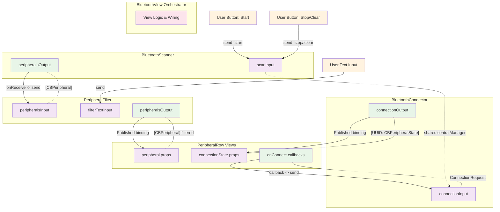

# System Wiring Diagram

This diagram shows how all components are composed together into a working Bluetooth scanning system.

## Complete System Architecture

## Wiring Summary

### Data Flow Paths:

1. **User Text Input → Filter**
   - `TextField` binding → `PeripheralFilter.filterTextInput.send()`

2. **User Buttons → Scanner**
   - Button actions → `BluetoothScanner.scanInput.send(.start/.stop/.clear)`

3. **Scanner → Filter**
   - `BluetoothScanner.peripheralsOutput` → `PeripheralFilter.peripheralsInput.send()`

4. **Filter → UI**
   - `PeripheralFilter.filteredPeripherals` → `PeripheralRow` props via `@Published`

5. **Connector → UI**
   - `BluetoothConnector.connectionStates` → `PeripheralRow.connectionState` via `@Published`

6. **UI → Connector**
   - `PeripheralRow.onConnect` callback → `BluetoothConnector.connectionInput.send()`

### Key Architectural Features:

- **Pure Input/Output**: Each component exposes only input subjects and output publishers
- **Reactive Composition**: Components are wired using Combine publishers and SwiftUI bindings
- **Shared Resources**: Scanner and Connector share the same `CBCentralManager` instance
- **Unidirectional Data Flow**: Clear flow from user actions through components to UI updates
- **Encapsulation**: All internal logic is private; only input/output ports are exposed

This architecture follows Unix philosophy principles where complex behavior emerges from simple components connected through well-defined interfaces.
