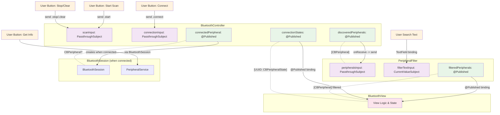

# Bluetooth System Architecture

This document describes the current Bluetooth component architecture and how components are wired together.

## Current System Components



## Component Architecture

### BluetoothController
*Unified Bluetooth management component*

**Inputs:**
- `scanInput: PassthroughSubject<ScanCommand, Never>`
- `connectionInput: PassthroughSubject<ConnectionRequest, Never>`

**Outputs:**
- `discoveredPeripherals: @Published [CBPeripheral]`
- `connectionStates: @Published [UUID: CBPeripheralState]`
- `connectedPeripheral: @Published CBPeripheral?`

**Responsibilities:**
- Device scanning and discovery
- Connection management
- Bluetooth state handling
- Central Manager operations

### PeripheralFilter
*Device filtering and search*

**Inputs:**
- `peripheralsInput: PassthroughSubject<[CBPeripheral], Never>`
- `filterTextInput: CurrentValueSubject<String, Never>`

**Outputs:**
- `filteredPeripherals: @Published [CBPeripheral]`

**Responsibilities:**
- Real-time peripheral filtering
- Search functionality
- List processing

### BluetoothSession & PeripheralService
*Connection-scoped communication*

**BluetoothSession:**
- Created when a peripheral connects
- Manages the PeripheralService lifecycle
- Provides high-level communication interface

**PeripheralService:**
- Initialized with connected peripheral
- Handles service discovery automatically
- Manages BLE communication protocol
- Processes commands and responses

## Data Flow Sequence

### 1. Discovery Phase
```
User Action → BluetoothController → PeripheralFilter → UI
"Start Scan" → scanInput → discoveredPeripherals → peripheralsInput → filteredPeripherals → View
```

### 2. Connection Phase
```
User Selection → BluetoothController → BluetoothSession
"Connect" → connectionInput → connectedPeripheral → BluetoothSession.init()
```

### 3. Communication Phase
```
User Request → BluetoothSession → PeripheralService → Device
"Get Info" → session.requestInfo() → service.sendCommand() → BLE Response
```

## Key Design Principles

### Simple
- Single BluetoothController handles all core Bluetooth operations
- Clear separation between discovery, connection, and communication
- Minimal abstractions that map directly to functionality

### Testable
- Pure input/output interfaces using Combine
- No public methods - only reactive data flow
- Clear component boundaries enable isolated testing

### Modular
- Components can be used independently
- Connection-scoped services (BluetoothSession/PeripheralService)
- Composable through reactive wiring

### Architecture Benefits

1. **Unified Management**: Single controller for all Bluetooth operations
2. **Connection Lifecycle**: Services created/destroyed with connections
3. **Memory Efficient**: No persistent state between connections
4. **Error Recovery**: Connection failures automatically clean up
5. **Future Extensible**: Easy to add new communication patterns
